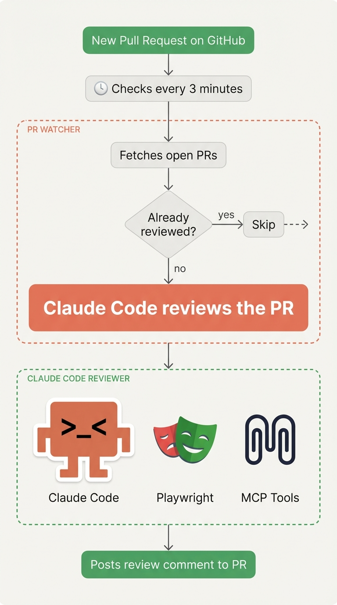
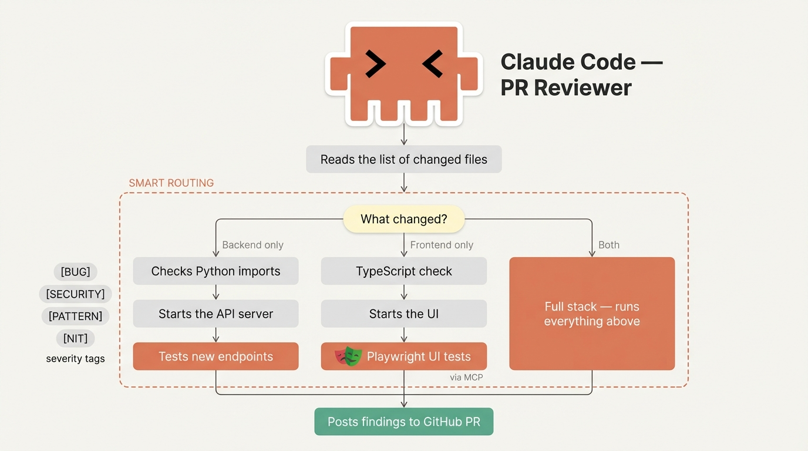

# Claude Code — PR Reviewer

An automated PR reviewer that runs **locally** on your machine using Claude Code. No GitHub App. No cloud CI. No secrets in GitHub.

A cron job polls your repo every 3 minutes. When a new PR (or new commits on an open PR) appears, it spawns a Claude Code subagent in an isolated git worktree that reviews the code, runs the app, tests it with Playwright, and posts a structured comment back to the PR.

---

<p align="center">
  
  &nbsp;&nbsp;&nbsp;
  
</p>

---

## How it works

```
Cron (every 3 min)
  └─ pr-watcher.sh
       ├─ gh pr list → find new/updated PRs
       ├─ skip already-reviewed (tracked by PR#:SHA)
       └─ claude --dangerously-skip-permissions -p "/review-pr N"
                 └─ /review-pr skill (Claude Opus, isolated worktree)
                      ├─ detect what changed (backend / frontend / both)
                      ├─ backend changed → start API → curl new endpoints
                      ├─ frontend changed → npm run dev → Playwright via MCP
                      └─ gh pr comment → post findings
```

**Re-reviews automatically** when new commits are pushed to an open PR (SHA changes → treated as new).

---

## Requirements

- [Claude Code](https://claude.ai/code) installed (`claude` CLI)
- [GitHub CLI](https://cli.github.com/) (`gh`) authenticated with repo access
- [Playwright MCP](https://github.com/microsoft/playwright-mcp) configured in Claude Code
- Python 3 (for date filtering in the watcher)

---

## Setup

### 1. Clone into your project

Copy this folder into your repo root, or clone it alongside your project:

```bash
git clone https://github.com/your-org/claude-pr-reviewer
cd claude-pr-reviewer
```

### 2. Configure your repo

Edit `pr-watcher.sh` and set your repo:

```bash
REPO="your-org/your-repo"
```

Or pass it as an env var:

```bash
REPO="your-org/your-repo" bash pr-watcher.sh
```

### 3. Customize review standards

Edit `REVIEW.md` with your project's conventions — auth patterns, naming rules, migration syntax, whatever matters to your stack. The skill reads this file automatically.

### 4. Install the Claude Code skill

Copy `.claude/` into your project root (or symlink it):

```bash
cp -r .claude/ /path/to/your/project/.claude/
```

### 5. Set up the cron job

```bash
chmod +x pr-watcher.sh

# Add to crontab (runs every 3 minutes)
(crontab -l 2>/dev/null; echo "*/3 * * * * REPO=your-org/your-repo bash /full/path/to/pr-watcher.sh") | crontab -

# Verify
crontab -l
```

---

## Monitoring

```bash
# Watch live output
tail -f .pr-watcher.log

# Trigger manually (don't wait for cron)
REPO=your-org/your-repo bash pr-watcher.sh

# Force re-review a specific PR
sed -i '' '/^197:/d' .pr-reviewed.txt
bash pr-watcher.sh

# See running review processes
ps aux | grep "review-pr"

# Remove the cron job
crontab -l | grep -v pr-watcher | crontab -
```

---

## State files

| File | Purpose |
|---|---|
| `.pr-reviewed.txt` | Tracks `PR#:headSHA` pairs — prevents duplicate reviews |
| `.pr-watcher.log` | Log of all watcher runs and review output |

Both are gitignored by default.

---

## Smart routing

The skill only starts what's needed based on changed files:

| Changed | What runs |
|---|---|
| Backend only | Import check → start API → curl new endpoints |
| Frontend only | TypeScript check → start UI → Playwright tests |
| Both | Everything |
| Schema/migrations only | Validation only, no services started |

Adapt the path patterns in `SKILL.md` Step 2 to match your folder structure.
